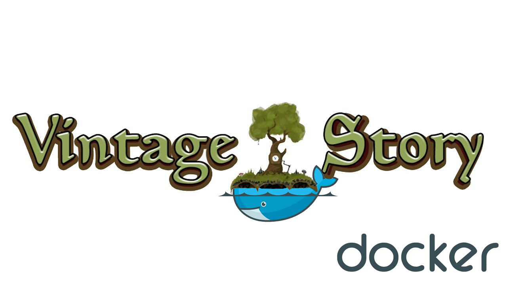

# DOCUMENTATION
Choose needle branch on git. (any - all versions, manual install server, check only `.NET` version) or (specific version, automatically install)

## BASE PARAMS
1) Count backups: 5 `see /src/scripts/vs_backup [countDays][6 line]`
2) Frequency backups: every day 00:00 `see /src/scripts/vs_crontab [3 line]`
3) Port: 42420

## REQUIREMENTS
1) [Docker](https://docs.docker.com/engine/install)

## QUICK STARTING
1) Run `sudo docker run -d --name vintage_story_server -p 42420:42420 --restart=unless-stopped -e TZ=Asia/Novosibirsk -v vintage_story_server:/var/vintage_story barenad/vintage_story_server:any_net_7` (change to suit yourself: -p - server port, -e - TimeZone, see `/etc/timezone`)
2) If you first time run command then run `sudo docker exec vintage_story_server bash -c "vs_update <full_url_download_server_archive_tar>"` ATTENTION! replace [full_url_download_server_archive_tar](https://account.vintagestory.at/) to choose needle version game server url (Linux tar.gz server only) (expand `(Show all available downloads and mirrors of Vintage Story)` right mouse button and copy the url link)
3) Run `sudo docker restart vintage_story_server`
4) Done! Now you can connect to the server. Or make the settings and install the necessary mods.

## Link to volume
To simplify access to the server folders, you can create a link directly from the root directory of the user
1) Run `sudo ln -s /var/lib/docker/volumes /root/docker_volumes`
2) Done! Now you can replace all paths `/var/lib/docker/volumes/vintage_story_server` -> `~/docker_volumes` (root user)

## How to get to the volume (server directories)
1) Run `su -` (change to root user)
2) Run `cd /var/lib/docker/volumes/vintage_story_server/_data`
3) `server` - server directory, `data` - server data directory

## How quick installation mods
1) Run `sudo docker exec -it vintage_story_server bash`
2) Run `cd /var/vintage_story/data/Mods`
3) Run `wget <full_url_download_mod>` ATTENTION! replace [full_url_download_server_archive_tar](https://mods.vintagestory.at/list/mod) to choose needle mod (repeat for all mods)
4) Run `exit`
5) Restart container `sudo docker restart vintage_story_server`

## WHERE PLACED BACKUPS
1) Run `su -`
2) Run `cd /var/lib/docker/volumes/vintage_story/_data/data/Backups`

### HOW TO GET INSIDE CONTAINER
1) Run `sudo docker exec -it vintage_story_server bash`

# DEVELOPMENT

## HOW STARTED
1) Pull or download repository
2) Run `build.sh`
3) Run `start.sh`
4) If you first started then run `update_server.sh <full_url_download_server_archive_tar>` ATTENTION! replace [full_url_download_server_archive_tar](https://account.vintagestory.at/) to choose needle version game server url (Linux tar.gz server only) (expand `(Show all available downloads and mirrors of Vintage Story)` right mouse button and copy the url link)

## HOW UPDATED MANUAL
1) Run `su -`
2) Run `cd /var/lib/docker/volumes/vintage_story/_data/server`
3) Run `wget -O server.tar.gz [PASTE_DOWNLOAD_URL]` or download and move archive manual (For example: scp)
4) Run `tar -xzf server.tar.gz`
5) Run `chmod +x ./server.sh`
6) Change `server.sh` parameters: `VSPATH='/var/vintage_story/server'`, `DATAPATH='/var/vintage_story/data'`

### HOW TO GET INSIDE CONTAINER
1) Run `attach.sh`

#### Convenient manager and editor
1) [MC](https://midnight-commander.org/)
